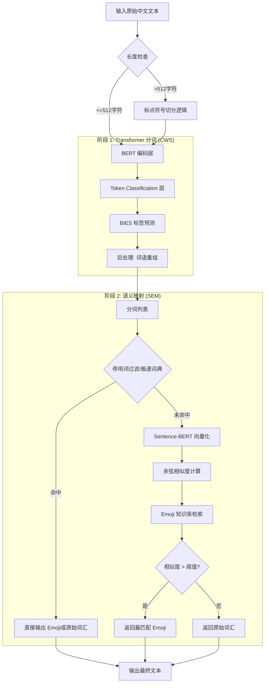
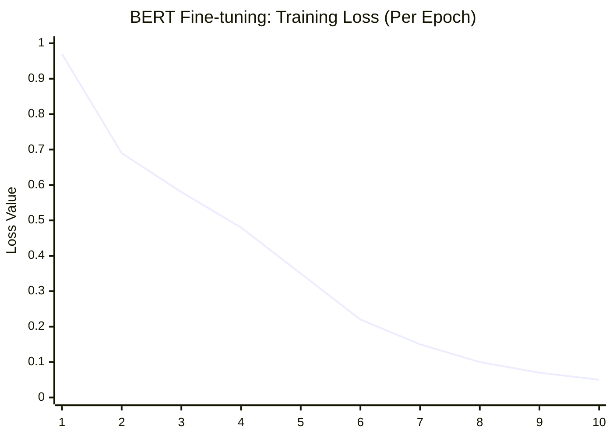
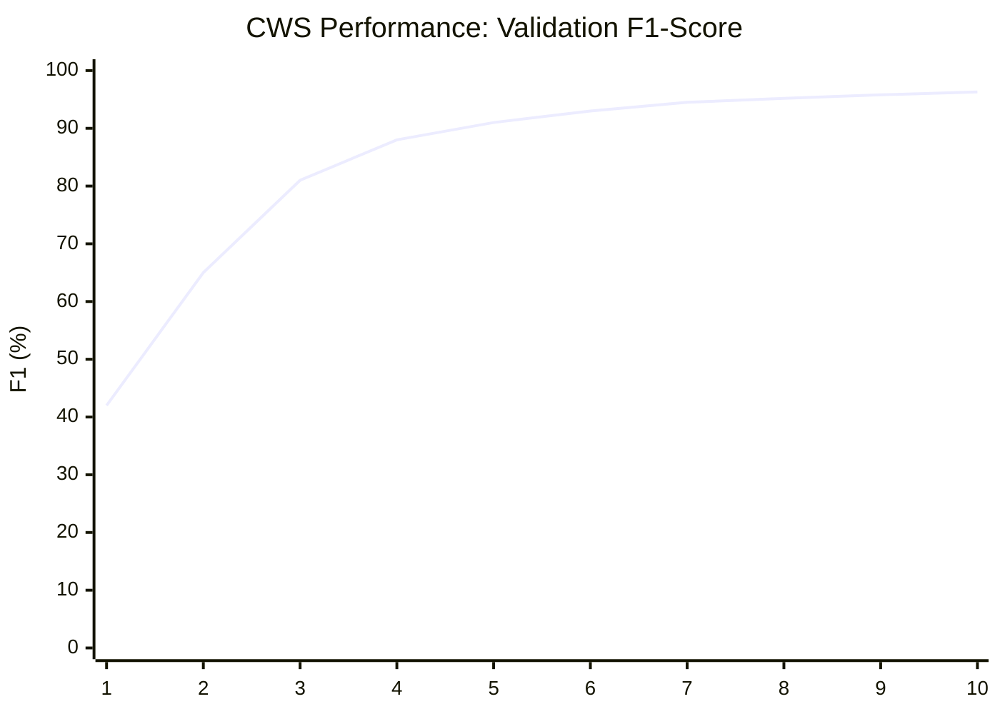
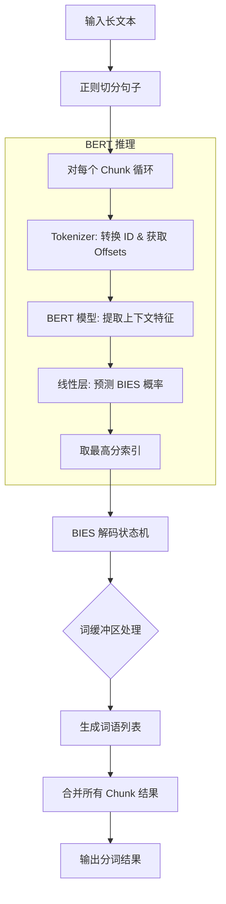

就像牢大离不开肘击，现代数字通信离不开 Emoji。Emoji 已经成为一种能够跨越语言障碍、增强情感表达和提升沟通趣味性的重要视觉元素。本项目旨在通过深度学习的技术，将 Emoji 自动嵌入到日常交流之中，提升表达的表现力，为日常沟通添加些许幽默感😋。

项目的核心驱动力源于对传统关键词匹配方案（即“查表法”）局限性的深刻洞察。传统的查表法虽然简单直接，但缺乏对语境和语义的理解，无法处理同义词、近义词或更深层次的语义关联。Zh2Emoji 的构想便是要突破这一瓶颈，利用深度学习模型强大的语义理解能力，让系统不仅能识别文本的字面含义，更能洞察其内在意涵，从而为中文文本智能匹配最贴切、最传神的 Emoji。

## 大致原理

本系统建立在**基于 Transformer 的序列标注分词**与**基于向量空间的语义相似度匹配**两个核心技术原理上，前者负责将输入的中文文本分词切割，后者负责将分割的词转换为对应的 Emoji。

### 基于序列标注的中文分词

#### 任务定义

系统架构将中文分词任务（Chinese Word Segmentation, CWS）建模为一个字符级的四分类序列标注问题。之所以选择这种模式，是因为它能让模型为输入文本中的每一个字符预测一个特定的归属标签，从而更精细地界定词汇边界。

为此，系统选用了业界成熟的 BIES 标签体系，因其能够清晰地表征词汇的边界信息。四个标签的含义如下：

• B (Begin): 标志着一个词汇的开始。
• I (Inside): 标志着一个词汇的中间部分。
• E (End): 标志着一个词汇的结束。
• S (Single): 标志着一个单字构成的词汇。

比如，针对`我们不说包的，但是可以说志在必得。`这句话：
```ascii
原句：我们不说包的，但是可以说志在必得。
标记：B E S S S S S B E B E S B I I E S
结果：我们 / 不 / 说 / 包 / 的 / ， / 但是 / 可以 / 说 / 志在必得 / 。
```

#### 解决方案

为了在有限的资源条件下（~~没💰买显卡~~）得到适合分词任务的模型，系统选用预训练的 BERT 模型进行微调，BERT 模型具有出色的上下文感知能力，适合分词任务。在预训练的 BERT 编码器之上，我们构建了一个线性分类头（Linear Classification Head），将 BERT 提取的 768 维稠密特征映射到 BIES 标签空间，从而实现高效的字符级推理。

对于给定的输入文本序列 $X$，模型的目标是预测出对应的标签序列 $Y$。其核心数学表示如下，模型通过一个全连接层和 Softmax 函数，计算出每个字符属于 BIES 四个标签中任意一个的概率分布：

$$
P(y_i | X) = \text{Softmax}(W \cdot \text{BERT}(X)_i + b)
$$

其中，$BERT(X)_i$​ 代表 BERT 模型最后一层为第 $i$ 个字符提取的深层特征向量，这确保了标签预测是基于对全局上下文的充分理解。

### 语义向量空间映射

为了实现超越关键词的“模糊匹配”能力（例如，让“咖啡”和“拿铁”都能准确匹配到 ☕），系统采用了先进的 Sentence-BERT (SBERT) 模型。传统 BERT 产生的向量存在“各向异性（Anisotropy）”问题，导致直接计算余弦相似度效果不佳。SBERT 通过孪生网络结构，将词汇映射到一个 **流形平滑（Manifold Smoothing）** 的语义空间，使得向量间的余弦距离能真实反映语义相关性，因此是本任务的更优选择。

其核心机制在于，SBERT 能够将不同的词汇（无论是待转换的中文词还是描述 Emoji 的英文词）都映射到同一个高维度的语义向量空间中。在这个空间里，意思相近的词汇，其对应的向量在空间位置上也更接近。系统通过计算待转换中文词汇的向量 $u$ 与候选 Emoji 描述的向量 $v$ 之间的**余弦相似度**来量化它们的语义关联度。

余弦相似度的计算公式如下：

$$
\text{similarity} = \cos(\theta) = \frac{\mathbf{u} \cdot \mathbf{v}}{\|\mathbf{u}\| \|\mathbf{v}\|} = \frac{\sum_{i=1}^{n} u_i v_i}{\sqrt{\sum_{i=1}^{n} u_i^2} \sqrt{\sum_{i=1}^{n} v_i^2}}
$$

该公式计算的是两个向量夹角的余弦值。当值越接近 $1$，代表两个向量方向越一致，即它们在语义上越相似。当计算出的相似度大于或等于用户设定的阈值 $τ$ 时，系统便会判定匹配成功并执行 Emoji 转换。

## 具体实现

本系统分为三个模块：
- Transformer 分词器 (CWS)
- 语义 Emoji 映射器 (SEM)
- Gradio 用户界面

其中 CWS 和 SEM 为核心功能模块，文本处理流程如下：



接下来分别介绍各个模块的具体实现细节。

### Transformer 分词器 (CWS)

实现分词器需要两个模块，一个负责将 BERT 模型微调训练为分词所需的模型，另一个负责将输入的文本传入模型，得到分词的结果并返回。

#### 微调训练

语料库采用的是 SIGHAN 2005 PKU 语料库，SIGHAN 2005 PKU 语料库是中文分词（Chinese Word Segmentation, CWS）领域最具代表性的标准数据集之一，由北京大学（PKU）提供，作为 2005 年国际中文分词评测（Second International Chinese Word Segmentation Bakeoff）的一部分。基础模型使用的是`bert-base-chinese`模型。损失函数使用交叉熵损失。

##### 数据预处理

在`train_cws.py`中定义`download_data`和`process_cws_file`两个函数：

```python
# --- 1. 下载并解压 SIGHAN 2005 数据集 ---
def download_data():
    data_url = "http://sighan.cs.uchicago.edu/bakeoff2005/data/icwb2-data.zip"
    target_file = "icwb2-data.zip"
    data_path = "icwb2-data"
    if not os.path.exists(target_file) and not os.path.exists(data_path):
        print("正在下载 SIGHAN 2005 语料库...")
        urllib.request.urlretrieve(data_url, target_file)
    
    if not os.path.exists(data_path):
        print("正在解压...")
        with zipfile.ZipFile(target_file, "r") as zip_ref:
            zip_ref.extractall()
    print("数据准备就绪。")

# --- 2. 数据处理：将空格分隔文本转换为 BIES 标注 ---
def process_cws_file(file_path):
    """
    输入: 北京  大学生  在  宿舍
    输出: {tokens: [北, 京, 大, 学, 生, 在, 宿, 舍], labels: [B, E, B, I, E, S, B, E]}
    """
    label_map = {"B": 0, "I": 1, "E": 2, "S": 3}
    samples = []
    
    with open(file_path, "r", encoding="utf-8", errors="ignore") as f:
        for line in f:
            line = line.strip()
            if not line:
                continue
            
            # 原始语料是以空格分隔词语
            words = line.split()
            tokens = []
            labels = []
            
            for word in words:
                if len(word) == 1:
                    tokens.append(word)
                    labels.append(label_map["S"])
                elif len(word) > 1:
                    tokens.append(word[0])
                    labels.append(label_map["B"])
                    for char in word[1:-1]:
                        tokens.append(char)
                        labels.append(label_map["I"])
                    tokens.append(word[-1])
                    labels.append(label_map["E"])
            
            if tokens:
                samples.append({"tokens": tokens, "labels": labels})
    return samples
```

其中`download_data`函数负责获取并解压语料库，`process_cws_file`将语料处理为训练所需的格式。

> 加载语料库时要注意编码问题！这里使用 UTF-8。

由于 BERT 的分词器会自动在句子开头加 [CLS]，结尾加 [SEP]。这会导致字符序列变长，原来的标签索引就对不上了，所以定义`tokenize_and_align_labels`函数用来实现索引对齐：

```python
def tokenize_and_align_labels(examples):
    tokenized_inputs = tokenizer(..., is_split_into_words=True)
    # ...
    for word_idx in word_ids:
        if word_idx is None:
            label_ids.append(-100) # 忽略 [CLS]/[SEP]
        else:
            label_ids.append(label[word_idx])
```

在 PyTorch 的 `CrossEntropyLoss` 中，`ignore_index` 默认就是 -100。通过给 [CLS] 等特殊符号打上 -100 的标签，模型在计算损失（Loss）时会自动跳过这些位置，确保模型只学习真实汉字的分类。

##### 模型架构

添加一个随机初始化的全连接层$W_{768 \times 4}$​即可。

```python
model = BertForTokenClassification.from_pretrained(
    model_checkpoint, num_labels=4
)
```

##### 训练策略与超参数

语料库中约有 1.9 万条预料，将其中的十分之一用作验证集，其余用作训练集。指标计算采用 F1。

```python
    split_idx = int(len(raw_data) * 0.9) 
    train_dataset = Dataset.from_list(raw_data[:split_idx])
    val_dataset = Dataset.from_list(raw_data[split_idx:])
    
    # ...
    
    # 指标计算
    metric = evaluate.load("seqeval")

    # ...
```

> 为什么采用 F1 而不是 Accuracy：
> - Accuracy 的局限性：如果 100 个字里有 80 个字标注对了，但正好是把词语中间的字标对了，而边界标错了，分词结果依然是错的。
> - F1-Score (Seqeval)：seqeval 会检查整个“词块”是否识别正确。只有当一个词的 B、I、E 标签全对时，才算一个成功的检索。F1 综合考虑了精确率（切出来的词有多少是对的）和召回率（原句中正确的词被切出来了多少），是分词任务的唯一金标准。

多次训练之后，得到的效果较好的超参数如下：

```python
    # 训练参数
    training_args = TrainingArguments(
        output_dir="./bert-cws-pku",
        eval_strategy="epoch",      # 每个 epoch 评估一次，查看真实的 F1
        save_strategy="epoch",
        eval_steps=500,
        learning_rate=2e-5,
        per_device_train_batch_size=32,
        num_train_epochs=10,
        weight_decay=0.01,
        warmup_ratio=0.1,    # 10% 预热
        save_total_limit=1,
        logging_steps=100,
        load_best_model_at_end=True,      # 自动加载 F1 最好的模型
        metric_for_best_model="f1",
        report_to="none", # 禁用 wandb 等
        no_cuda=not torch.cuda.is_available(), # 根据 GPU 可用性设置
    )
```

使用以上超参数训练所需显存大约 4~ 5GB：


> 使用我的 RTX 4080 Laptop 训练一次需要16～20分钟，我只训练了大约十几次，所以这里的超参数不一定是最好的。

训练效果：





训练结束时，损失（Loss）控制在 $0.005$，F1 分数达到 $0.979$，达到分类任务所需标准。

#### 使用训练后的模型分词

##### 加载模型

```python
self.tokenizer = BertTokenizerFast.from_pretrained(model_path)
self.model = BertForTokenClassification.from_pretrained(model_path).to(self.device)
self.model.eval()
self.id2label = {0: "B", 1: "I", 2: "E", 3: "S"}
```

这里定义了一个数字 ID 到 BIES 字符的映射，用于将模型的分类输出转回人类可读的标签。

##### 长文本分割策略

为突破 BERT 的 512 Token 长度限制，系统采用基于正则表达式的规则策略，在自然断句符（如句号、问号）处对长文本进行无损切分。

```python
def segment(self, text):
        if not text.strip():
            return []

        # --- 新增：长文本切分逻辑 ---
        # 使用正则表达式按标点符号切分，保留标点
        # 这样可以确保每一段都不会超过 BERT 的 512 长度限制
        max_chunk_size = 400 # 建议设为 400，给 [CLS] 等留出空间
        
        if len(text) <= max_chunk_size:
            return self._do_segment(text)
        else:
            # 按标点切分句子
            # [。！？；] 后面跟着的部分会被切开
            sentences = re.split(r'([。！？；])', text)
            
            # 将切开的标点补回句子后面
            chunks = []
            for i in range(0, len(sentences)-1, 2):
                chunks.append(sentences[i] + sentences[i+1])
            if len(sentences) % 2 != 0:
                chunks.append(sentences[-1])
                
            # 逐段分词并合并
            all_words = []
            for chunk in chunks:
                if chunk.strip():
                    all_words.extend(self._do_segment(chunk))
            return all_words
```

分割时从第 400 个字开始分割，留有一定余量的同时也可以防止硬性截断。

##### 核心推理逻辑

首先计算偏移映射（Offset Mapping）：

```python
inputs = self.tokenizer(..., return_offsets_mapping=True)
offsets = inputs.pop("offset_mapping")[0].cpu().numpy()
```

BERT 处理的是 Token，而我们需要返回原始字符。有了`offsets`，即使文本包含空格、特殊符号或截断，我们也能准确地找回原字符。

之后进行标记：

```python
with torch.no_grad():
    outputs = self.model(**inputs)
    predictions = torch.argmax(outputs.logits, dim=-1)[0].cpu().numpy()
```

模型对每个字会输出 4 个分数（对应 BIES）。我们取分数最高的索引作为最终预测标签。

标记之后，将标签重组为词语:

```python
for i in range(len(predictions)):
    start, end = offsets[i]
    if start == end: continue  # 过滤 [CLS], [SEP]
    label = self.id2label[predictions[i]]
    char = text[start:end]
```

在解码的过程中，需要维护一个当前词缓冲区`current_word`：
- 标签 S (Single)：表示该字独立成词。如果缓冲区里有字，先闭合旧词，再直接添加该字并存入结果。
- 标签 B (Begin)：表示新词的开始。如果缓冲区里有未完成的词，先强制闭合它，然后开始存入这个新词的首字。
- 标签 I (Inside)：表示词语中间。直接追加到缓冲区。
- 标签 E (End)：表示词语结束。追加到缓冲区后，立即闭合词语并存入结果列表。

整个推理流程如下：



### 语义 Emoji 映射器 (SEM)

语义 Emoji 映射器（SEM）是本系统的核心智能组件。它负责将分词后的纯文本转换为具有语义关联的表情符号。与传统的“关键词映射”不同，该模块基于 **向量空间搜索（Vector Space Search）** 技术实现。

#### 加载模型

```python
    def __init__(self, model_name='paraphrase-multilingual-mpnet-base-v2', threshold=0.5):
        print("正在初始化 Emoji 语义引擎...")
        self.device = "cuda" if torch.cuda.is_available() else "cpu"
        self.model = SentenceTransformer(model_name).to(self.device)
        # ...
```

模型使用的是 MPNet 的多语言版本。它在一个共享的向量空间中对 50 多种语言进行了“对齐”训练。这使得我们可以直接使用英文的 Emoji 库（emojilib）来匹配中文分词结果，而无需进行繁琐的翻译工作。

#### 知识库预处理与集成

```python
def load_external_emojilib(self):
    # ... 从 GitHub 下载或读取本地 JSON ...
    for emoji_char, keywords in data.items():
        self.emoji_library[emoji_char] = " ".join(keywords)
# ...
self.emoji_embeddings = self.model.encode(self.descriptions, convert_to_tensor=True)
```

emojilib 为每个 Emoji 提供了多个标签（如 🍎 对应 apple, fruit, red, food），代码将这些标签合并成一段描述文本。由于此过程在系统初始化时进行，可以一次性计算出库中所有 Emoji 描述词的向量并存入显存/内存，这种“预计算”方式避免了在用户输入时重复计算 Emoji 向量，将每次转换的时间复杂度从 $O(N \times Model)$ 降低到 $O(Model + N \times Similarity)$。

> 代码实现中，我添加了一个 dict 用于硬编码一些 Emoji 到知识库中，但是硬编码的 Emoji 的分数明显高于外部知识库，使得生成的文本中容易出现大量的硬编码 Emoji，所以这个 dict 是空的。

#### 多级过滤机制 (The Multi-tier Pipeline)

为了保证转换质量，代码实现了一套从“人工规则”到“人工智能”的级联过滤系统：

##### 停用词拦截

```python
if word in self.stopwords: return word
```
诸如“的”、“因为”、“然后”等虚词在语义空间中非常模糊，极易被错误地映射到无关 Emoji。拦截这些词能极大减少“满屏火 🔥”或“满屏垃圾桶 🗑️”的现象。

##### 极速词典

```python
if word in self.hot_dict: return self.hot_dict[word]
```
针对“拿铁”、“代码”等目标明确的词汇，以及“电棍”、“otto”等包含亚文化属性（模型无法理解）的特定梗，通过 hot_dict 强制转换，既保证了 100% 的准确率，又节省了计算资源。

##### 单字保护逻辑

```python
if len(word) == 1 and word not in meaningful_single_chars: return word
```
中文单字词歧义极多。除了“火”、“猫”、“狗”等具有强烈具象意义的单字外，其余单字（如“说”、“个”、“走”）通常不具备稳定的 Emoji 对应关系，故选择保留原文字。

#### 语义搜索与余弦相似度

```python
word_embedding = self.model.encode(word, ...)
cos_scores = util.cos_sim(word_embedding, self.Emoji_embeddings)[0]
top_result_idx = torch.argmax(cos_scores).item()
best_score = cos_scores[top_result_idx].item()

#...

if best_score >= self.threshold: return self.emojis[top_result_idx]
```

余弦相似度在原理中已经介绍过，这里就不再赘述。使用余弦相似度计算得到分数之后，如果最高分低于阈值，说明模型觉得“这个词跟库里的任何 Emoji 都不太像”，此时返回原文字。这是一种拒识机制，能有效保证输出的可读性。

### Gradio 用户界面

用户界面依旧简简单单，左右一分为二，分别用来获取用户输入和给出输出结果。此外，在下面添加了几个例子用于快速查看效果。

```python
with gr.Blocks(title="中文分词 Emoji 转换器") as demo:
    gr.Markdown("""
    # 🇨🇳 中文分词 Emoji 转换器
    这个应用使用 **Transformer (BERT)** 进行精确的中文分词，并使用 **Sentence-BERT** 实现词语到 Emoji 的语义映射。
    """)
    
    with gr.Row():
        with gr.Column():
            input_text = gr.Textbox(
                label="输入句子", 
                placeholder="例如：我喜欢在下午喝一杯拿铁，然后用笔记本写代码。",
                lines=3
            )
            threshold_slider = gr.Slider(
                minimum=0.0, 
                maximum=1.0, 
                value=0.55, 
                step=0.05, 
                label="Emoji 匹配阈值 (越高越精准，越低转换越多)"
            )
            btn = gr.Button("开始转换", variant="primary")
        
        with gr.Column():
            output_seg = gr.Textbox(label="第一步：分词结果", lines=5, max_lines=20)
            output_emoji = gr.Textbox(label="第二步：Emoji 转换结果", elem_id="emoji_out", lines=5, max_lines=20)
            
    # 绑定事件
    btn.click(
        fn=translate_to_emoji,
        inputs=[input_text, threshold_slider],
        outputs=[output_seg, output_emoji]
    )
    
    gr.Examples(
        examples=[
            ["我喜欢在下午喝一杯拿铁，然后用笔记本写代码。", 0.55],
            ["今天天气真不错，我想去公园跑步。", 0.45],
            ["研究生命的起源是一件很有意义的事情。", 0.6],
        ],
        inputs=[input_text, threshold_slider]
    )

```

## 部署

关于部署方案，我选择先在本地完成模型训练，然后将训练好的模型权重通过 Git Lfs 的方式上传到 Hugging Face Spaces 中，使用默认配置即可获得良好的响应速度。


## 小结

本次系统实现效果我比较满意，但是依然有一些小问题没有解决，比如个别 Emoji 高频出现在文本中。后续可能会尝试引入中文标记的 Emoji 知识库以获得更精确的匹配，或者将 BERT 模型的上一层输出一并传入到语义 Emoji 映射模块中，以添加上下文信息。

> - Github 仓库：https://github.com/gujial/zh2emoji
> - 应用地址：https://huggingface.co/spaces/gujial/zh2emoji