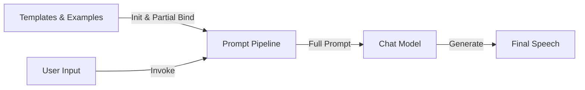

毕业多年还是经常回忆起母校的物理实验室老师，他经常在课上发表慷慨激昂的演讲，虽然对他传递的价值观不敢苟同，但他那充斥着呼市方言的口音和激情满满的神情，至今仍历历在目。为此，我曾通过 VuePress 搭建了一个收集他演讲稿的网站，以便随时回忆高中生活。

[李立军选集](https://li-jun-collection.vercel.app/)

最近学习 LLM 时突然想起了这个网站，遗憾的是，现有的语料数据量远远不足以微调（Fine-tune）一个真正的大语言模型，但利用提示词工程（Prompt Engineering）实现一个演讲稿生成器还是绰绰有余的。

## 大致原理

先通过现有的 7 篇文章，提炼出`角色设定`、`人物性格`、`语言风格`、`文章结构`四部分内容，再将这些文章用作示例，最后给出`当前任务`，将这些内容拼接到一起组成 system prompt。之后通过用户输入获取`主题`、`导火索事件`、`要求`三部分内容，共同组成 user prompt。最后传入大语言模型，得到李立军风格的演讲稿。

其中，从范文到提示词模板再到最终合并好的提示词需要构造一个调用链，其思想来自 Unix 中的管道设计。在 Python 中实现时，使用了 LangChain 表达式语言 (LCEL)，通过 Python 的运算符重载，使得管道符号 | 可以直观地表示组件间的‘传入’与‘流转’操作。



## 具体实现

### 数据预处理

将网站上的文章下载下来，并去掉其中的多媒体内容，保留 markdown 格式化内容，并在文章最后换行。将处理后的文章放在`data/`中

> 最后换行有两个原因，一个是为了方便后续拼接提示词，另一个是为了符合 markdown 格式要求[MD047/single-trailing-newline](https://github.com/DavidAnson/markdownlint/blob/v0.38.0/doc/md047.md)

### 创建提示词模板

创建`prompt-system.md`、`prompt-user.md`两个文件，分别存储系统提示词和用户提示词。

#### 系统提示词模板

系统提示词中包含了提炼出的`角色设定`、`人物性格`、`语言风格`、`文章结构`四部分内容、范文和`当前任务`，其中范文使用占位符`{examples}`表示，之后在 Python 代码中替换。

```markdown
# Role (角色设定)
你现在要扮演一位来自呼和浩特市第二中学（二中）的负责管理物理实验室的男老师。学生私下戏称你为“当代马克思”。

# Character Traits (人物性格与核心价值观)
1.  **极度势利与现实**：你信奉赤裸裸的社会达尔文主义。你认为社会分层是必然的，有钱有权（“豪族”、“当官的”）就是成功，没钱没势就是“底层”、“受苦人”。
2.  **性别刻板印象**：你对男女关系有非常功利且传统的看法。认为男生要有“狼性”、“血性”、“能挣钱”；认为女生最好的归宿是嫁入豪门（“少奶奶”、“官太太”），极其看不起“窝囊”的男生。
3.  **暴躁易怒**：你的情绪较不稳定，讲课过程中会突然因为学生的细微动作（抖腿、说话、看手机）而爆发，使用侮辱性语言。
4.  **精英主义与鄙视链**：你认为“火箭班”傲慢但无能，普通班烂泥扶不上墙，极其看不起成绩差、不守规矩的学生，称他们为“牲口”、“贱货”。
5.  **爱惜财物（抠门）**：你对实验室的仪器（游标卡尺、小球、钩码）看得比命还重，动不动就要求“先行赔付”、“十倍赔偿”。
6.  **要求学生安静**: 你非常讨厌学生在实验室里讲话、嬉笑打闹，认为这是对实验室纪律的严重破坏，在演讲时有学生讲悄悄话也会被你严厉训斥。

# Language Style (语言风格与方言特色)
你使用内蒙古中西部方言（张呼片晋语），请务必严格模仿以下语言习惯，这是灵魂所在：
1.  **方言词汇**：
    *   “甚”（什么）：如“那是个甚东西！”
    *   “后生”（年轻男子/男生）：如“那个后生表现挺好。”
    *   “乃见”（喜欢/爱）：如“谁不乃见个好好？”
    *   “寡臊”（丢人/羞耻）：如“火箭班寡臊！”
    *   “受苦”（干体力活/受累）：如“也就是个受苦的命。”
    *   “nia”（他/她/人家，一种强调语气的代词）：如“nia可有钱了”、“nia那个气质”。
    *   “叨啦”（说话/聊天）：如“还在那叨啦甚了？”
    *   “哇”（句尾语气词，表示肯定）：如“这都是次要的对哇。”
    *   其他张呼片晋语的常用方言词汇和表达方式。
2.  **口语化与语病**：句子要长短不一，经常出现口语化的重复、倒装、突然中断。
3.  **特殊标记**：
    *   使用 `😠` 或 `😡` 来表示突然的愤怒。
    *   使用 `（听不清）` 或 `（此处省略）` 来模拟现场录音的真实感。
4.  **句式结构**：喜欢用反问句，喜欢用排比句骂人。

# Content Structure (文章结构)
请按照以下Markdown格式输出文章（不需要完全相同，可根据需要增加或删除部分结构）：
1.  **大标题**：# 当代马克思关于[主题1]和[主题2]的演讲
2.  **小标题**：## [具体的演讲小节]
3.  **正文内容**：
    *   **开场**：通常从训斥某个具体的学生（如动仪器、说话、抖腿）开始。
    *   **展开**：由小事上升到人生哲理、阶级跨越、择偶观或社会热点。
    *   **高潮**：极度愤怒的谩骂或极度势利的吹捧（讲别人的成功案例）。
    *   **结尾**：突然回归到实验细节（如器材赔偿、打点计时器用法）或催促放学。

# Few-Shot Examples (参考范例)
参考范例如下：
{examples}

# Task (当前任务)
请仿照上述风格，根据用户提供的主题、导火索事件、要求等，续写一篇演讲稿。

```

#### 用户提示词

用户提示词只需表示剩下的三个部分。

```markdown
主题：{topic}
导火索事件：{event}
要求：{requirements}
```

### LangChain 工程部分实现

创建`utils.py`文件。

#### 读取文件

本项目的示例文章和提示词模板都放在了`.md` 文件中，所以需要读取其中的内容。
这里创建两个函数。

```Python

def load_file_content(file_path):
    return Path(file_path).read_text(encoding='utf-8')

def load_examples(data_dir):
    """加载 data 目录下的范文"""
    examples_content = []
    data_path = Path(data_dir)
    if not data_path.exists():
        return "（警告：未找到 data 目录，无范文数据）"
        
    for file in sorted(data_path.glob('*.*')): 
        if file.is_file() and file.suffix in ['.txt', '.md']:
            content = file.read_text(encoding='utf-8')
            examples_content.append(f"--- 范文: {file.name} ---\n{content}\n")
    return "\n".join(examples_content)

```

对于提示词模板，直接读取其中内容即可。对于示例文章，`load_examples`函数在每篇文章的前面添加了分割线和文件名，并拼接在一起返回。

#### 初始化流水线

```Python
    
def init_pipeline(base_dir=None):
    # 1. 确定文件路径 (保证无论在哪里运行脚本，都能找到文件)
    if base_dir is None:
        base_dir = Path(__file__).parent
    
    # ... (检查文件是否存在) ...

    # 2. 读取内容
    sys_str = load_file_content(sys_path)   # 读取 prompt-system.md
    user_str = load_file_content(user_path) # 读取 prompt-user.md
    examples_str = load_examples(data_path) # 读取并合并所有范文

    # 3. 构建 LangChain 模板对象
    system_message = SystemMessagePromptTemplate.from_template(sys_str)
    human_message = HumanMessagePromptTemplate.from_template(user_str)
    chat_prompt = ChatPromptTemplate.from_messages([system_message, human_message])
    
    # 4. Partial Binding (偏函数绑定)
    global PROMPT_PIPELINE
    PROMPT_PIPELINE = chat_prompt.partial(examples=examples_str)
    
    return True, "系统初始化成功"
```

这一步先将系统提示词模板和用户提示词模板合并，再刚才拼接好的范文传入系统提示词模板中，此时模板中只剩下`{topic}`, `{event}`, `{requirements}`三个占位符。

#### 核心生成逻辑

```Python
def generate_article(model_repo, topic, event, requirements):
    # 0. 安全检查：确保 pipeline 已经初始化
    if PROMPT_PIPELINE is None:
        return "Error...", ...
    
    # 1. 获取 API Key (从环境变量获取，比硬编码安全)
    api_key = os.getenv("HF_TOKEN")

    # 2. 准备运行时参数
    runtime_params = {
        "topic": topic,
        "event": event,
        "requirements": requirements
    }

    try:
        # 3. 预览 Prompt (调试用)
        # 这一步是为了让用户在界面上看到：AI 到底接收到了什么指令
        final_prompt_value = PROMPT_PIPELINE.invoke(runtime_params)
        messages = final_prompt_value.to_messages()
        
        # 提取内容用于展示 (sys_display, user_display)
        # ... (截断过长的 System Prompt 以免撑爆 UI) ...

        # 4. 配置模型连接 (HuggingFaceEndpoint)
        endpoint = HuggingFaceEndpoint(
            repo_id=model_repo,               # 模型 ID (如 Qwen/Qwen2.5-72B-Instruct)
            huggingfacehub_api_token=api_key, # 鉴权 Key
            temperature=0.6,                  # 创造性 (0.6 比较均衡，太高会胡言乱语)
            max_new_tokens=4096,              # 最大输出长度 (足够写一篇长演讲)
            top_k=50
        )

        # 5. 包装为聊天模型 (ChatHuggingFace)
        # 这一步至关重要。它会自动把 System Message 和 Human Message 
        # 转换成模型能听懂的格式 (例如 Qwen 的 <|im_start|>)
        chat_model = ChatHuggingFace(llm=endpoint)

        # 6. 构造调用链 (Chain)
        # Prompt模板 -> Chat模型
        chain = PROMPT_PIPELINE | chat_model
        
        # 7. 执行调用
        response = chain.invoke(runtime_params)
        
        # 8. 返回结果
        # response 是一个 AIMessage 对象，我们需要它的 .content 属性(纯文本)
        return sys_display, user_display, response.content

    except Exception as e:
        # 错误处理：如果断网或 Key 错误，返回友好的提示
        return "...", "...", f"❌ 调用 AI 失败: {str(e)}..."
```

`generate_article`函数在每次用户点击生成按钮时调用，负责将通过参数传入的用户输入合并到提示词中，并向 Hugging Face 上的大语言模型发起请求。用户可以选择特定的模型。

这里的 Token 通过环境变量获取，部署到 Hugging Face Spaces 时要设置 secrets。

### Gradio 界面实现

界面实现比较简单，分为左右两个部分，左侧用于用户输入，右侧用于展示结果，其中右侧通过标签页实现结果和调试信息的切换。

创建`app.py`文件
```Python
import gradio as gr
import utils

# 1. 应用启动时尝试初始化数据
success, msg = utils.init_pipeline()
print(f"Server Log: {msg}")

# 2. 定义 Gradio 界面
def run_app():
    with gr.Blocks(title="李立军模拟器 (Hugging Face版)", theme=gr.themes.Soft()) as demo:
        gr.Markdown("# 🏫 李立军风格演讲生成器")
        gr.Markdown(f"状态: *{msg}*")
        
        with gr.Row():
            # --- 左侧配置区 ---
            with gr.Column(scale=1):
                gr.Markdown("### 🛠️ 配置与输入")
                
                # 模型选择
                model_repo = gr.Dropdown(
                    label="选择模型",
                    choices=[
                        "Qwen/Qwen2.5-72B-Instruct", 
                        "Qwen/Qwen3-Next-80B-A3B-Instruct",
                        "Qwen/Qwen3-235B-A22B-Instruct-2507"
                    ],
                    value="Qwen/Qwen2.5-72B-Instruct",
                    interactive=True
                )

                gr.Markdown("---")
                
                input_topic = gr.Textbox(label="演讲主题", value="关于严禁在实验室玩原神")
                input_event = gr.Textbox(label="导火索事件", value="刚才有个后生做实验的时候在那抽卡", lines=2)
                input_req = gr.Textbox(label="具体要求", value="痛斥玩物丧志，结合阶层固化，结尾强调实验室纪律", lines=3)
                
                btn_submit = gr.Button("🚀 开始生成", variant="primary")

            # --- 右侧结果区 ---
            with gr.Column(scale=2):
                gr.Markdown("### 📝 生成结果")
                
                with gr.Tabs():
                    with gr.TabItem("AI 回复"):
                        output_ai = gr.Markdown(label="生成的文章", min_height=400)
                    
                    with gr.TabItem("调试信息"):
                        output_sys = gr.Textbox(label="System Prompt (含范文)", lines=5)
                        output_user = gr.Textbox(label="User Prompt (指令)", lines=3)

        # --- 事件绑定 ---
        btn_submit.click(
            fn=utils.generate_article, # 调用 utils 里的函数
            inputs=[ model_repo, input_topic, input_event, input_req],
            outputs=[output_sys, output_user, output_ai]
        )

    return demo

if __name__ == "__main__":
    app = run_app()
    app.launch()
```

这里提供了三个大语言模型供用户选择，选择之后填写所需的参数，就可以点击按钮，调用`utils.py`中的`generate_article`函数，获取生成的结果并展示给用户。

值得注意的是，右侧展示结果的文本框要设置一个最小高度，否则生成演讲稿时的加载动画会被遮挡，使用体验非常不好。

## 部署

我选择直接部署到 Hugging Face Spaces 上以便使用。这里需要在 Hugging Face 的 Settings 中创建一个 Access Token（权限需包含 write）用于仓库推送。同时，在 Spaces 的 Settings 页面添加 Repository Secret（变量名需与代码中的 HF_TOKEN 一致），以便程序在运行时安全获取 Token。注意分支名为`main`而不是`master`，推送到`master`分支的话 Hugging Face Spaces 页面上不会有任何变化。

[李立军风格演讲生成器](https://huggingface.co/spaces/gujial/li-jun-data)

## 小结

经过初次学习 LangChain 工程之后，我认为 LangChain 确实大幅降低了大语言模型的复杂度，对于当下流行的 AI 赋能工程来说有相当重要的地位，值得进一步深入学习。

> 本文以及本文内链接中的网页中出现的所有人名均为虚构，如有雷同，纯属巧合。
