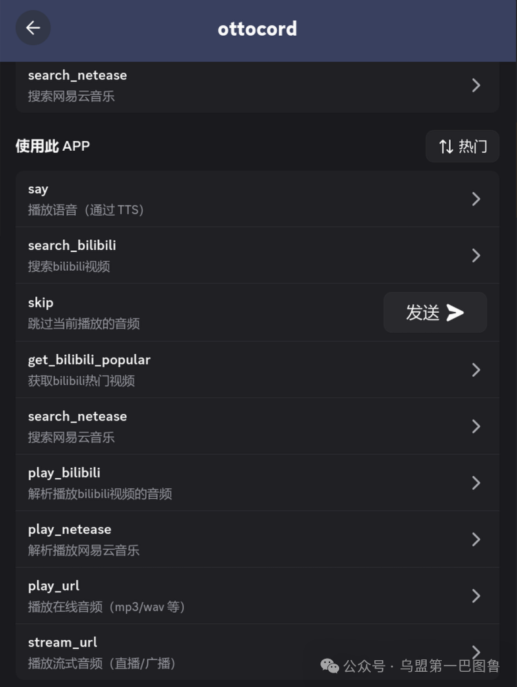
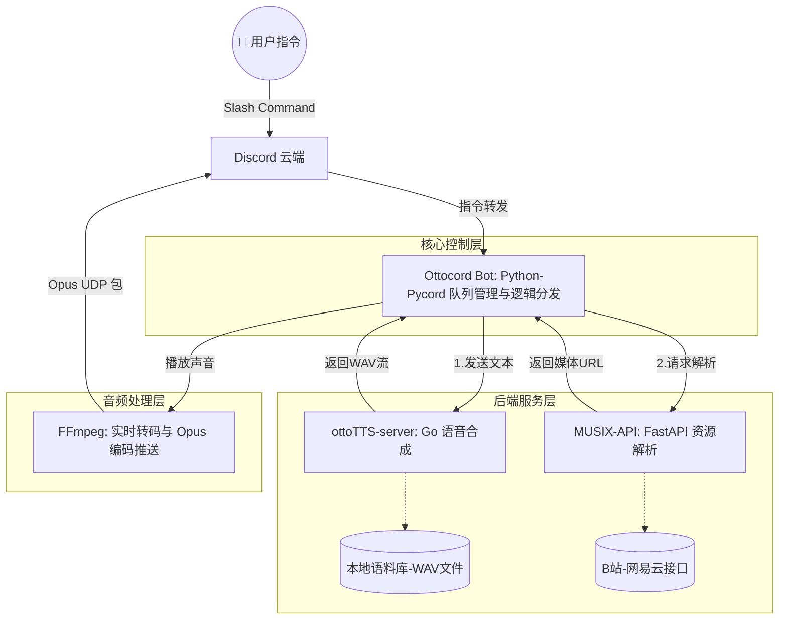
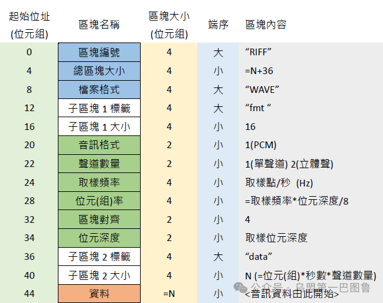
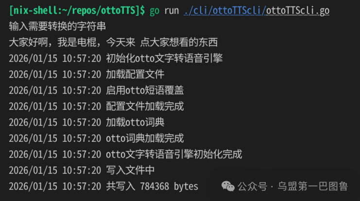
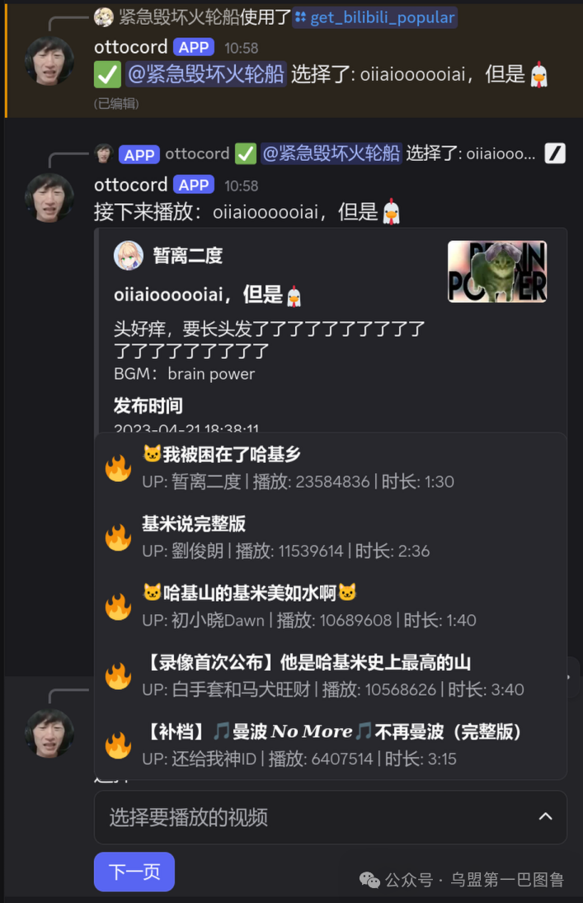
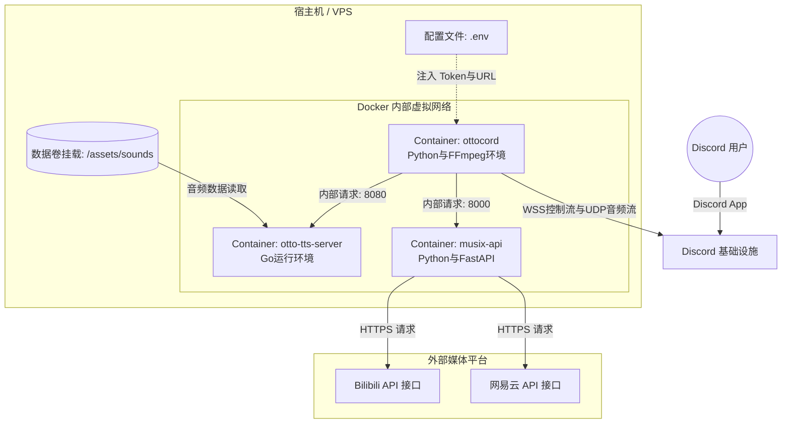
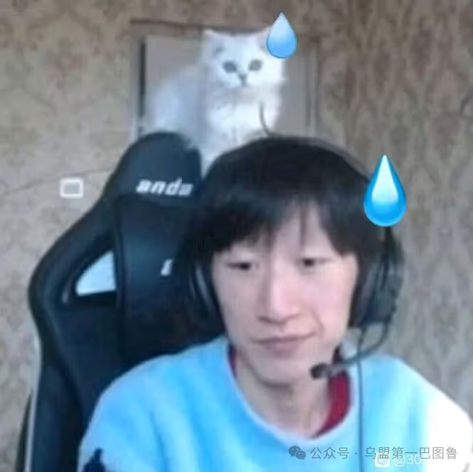

> 本篇源代码丢失，迁移自微信公众号

## 引言：为什么我们需要一个“棍系”机器人？

在 Discord 的中文社区生态中，音乐机器人并不少见，但它们大多面临一个尴尬的局面：要么只支持 YouTube/Spotify，对国内的神人音乐（如《叮咚鸡》、《新年好物业》）一窍不通；要么虽然支持国内平台，但缺乏灵魂——那种能随时用“电棍”的声音进行报幕、互动、甚至深情朗诵的沉浸感。


<center>新年好物业</center>

为了挽救日益枯燥的语音频道，**Ottocord** 横空出世。它不仅仅是一个点歌机，它是一个将“活字印刷”语音合成（TTS）、多平台媒体协议逆向、以及分布式微服务架构融为一体的硬核工程实践。


<center>功能展示</center>

## 一、 需求解构：从“活字印刷”到“全能点播”

我要实现的系统主要承载两大核心功能：

1. **灵魂合成（TTS 引擎）**：  
为了符合亚文化惯例，我拒绝使用呆板的 AI 神经语音，而是采用\*\*“活字印刷法”\*\*。通过预录制电棍的大量原始音节，根据文字输入进行动态拼接。我需要处理拼音转换、多音字纠正、以及特定短语（梗）的优化匹配。
2. **媒体聚合（MUSIX 服务）**：  
神人音乐散落在哔哩哔哩（B站）和网易云音乐的各个角落。我需要一套能够绕过防盗链、支持高码率解析、甚至能处理 B 站音画分离（DASH）协议的后端，将这些资源转化为 Discord 能够播放的流。

## 二、 系统架构：解耦与协作

本着“不造重复轮子”和“高内聚低耦合”的原则(~~正好有做好的项目~~)，我将 Ottocord 拆分为三个独立的服务。这种分布式架构不仅方便维护，也允许各组件使用最适合其任务的语言开发。



## 三、 实现深度：ottoTTS 语音合成服务

### 1\. 拼接算法：基于最大匹配原则的文本解析

TTS 服务的核心在于将汉字转化为拼音序列。我选择了 Go 语言实现，利用其极高的 I/O 处理效率来应对密集的音频文件读取。

**算法细节：**  
为了让合成的声音更自然，我实现了一个**正向最大匹配（FMM）算法**。系统不仅查找单个字的拼音，还会根据 `dictionary.json` 优先匹配长短语。

```json
{  
  "expressions": [  
    {  
      "expression": ["米浴说的道理", "啊米浴说的道理"],  
      "otto": "miyu"  
    },  
    {  
      "expression": ["大家好啊", "大家好"],  
      "otto": "djha"  
    },  
    {  
      "expression": ["我是说的道理"],  
      "otto": "wssddl"  
    },  
  
    // ...
```


<center>说的道理</center>

* **匹配逻辑**：如果输入“我是电棍”，匹配器会先看“电棍”是否在词典中。如果是，则直接提取预录制的完整片段 `diangun.wav`，而非拼接 `dian` 和 `gun`。
* **节奏控制**：遇到标点符号时，系统调用 `SilentWAV` 函数动态生成一段毫秒级的空采样，为朗诵增加“换气感”。

### 2\. 二进制级的 WAV 拼接

WAV 文件由 Header 和 Data 两部分组成。拼接时，我不能直接连接两个文件，否则第二个文件的 Header 会产生巨大的噪音。

```go
// ConcatenateWAVs 的技术细节  
func ConcatenateWAVs(wavs []*WAV) (*WAV, error) {  
    base := wavs[0]  
    for _, w := range wavs[1:] {  
        // 关键点：所有片段必须强制统一采样率（SampleRate）和位深（BitsPerSample）  
        if w.SampleRate != base.SampleRate {  
            return nil, errors.New("采样率不一致")  
        }  
        // 只拼接 Data 部分  
        base.Data = append(base.Data, w.Data...)  
    }  
    return base, nil  
}
```


<center>WAV 文件结构</center>

随后，我根据拼接后的总数据长度重新计算并填写 44 字节的 WAV 头。这种底层的二进制处理保证了音频流的纯净，没有爆音。


<center>音频合成</center>

### 3\. 服务封装

之后将核心功能封装为一个 GoLang 包，用 Gin Web Framework 将核心功能包封装为一个 HTTP 服务。

```go
r.POST("/speak", func(c *gin.Context) {  
        var req MessageRequest  
        if err := c.ShouldBindJSON(&req); err != nil {  
            c.JSON(http.StatusBadRequest, gin.H{"error": err.Error()})  
            return  
        }  
  
        wavData, err := ottoTTS.Speech(req.Message)  
        if err != nil {  
            log.Println(err)  
            c.JSON(http.StatusInternalServerError, gin.H{"error": "failed to generate speech"})  
            return  
        }  
  
        c.DataFromReader(http.StatusOK, int64(len(wavData)), "audio/wav",  
            http.NoBody, map[string]string{  
                "Content-Disposition": `attachment; filename="speech.wav"`,  
            })  
        c.Data(http.StatusOK, "audio/wav", wavData)  
    })
```

## 四、 实现深度：MUSIX 媒体解析服务

### 1\. 业务逻辑抽象

MUSIX 采用 Python 的 FastAPI 框架。为了兼容不同的音乐平台，我设计了一套类继承体系：

```python
class MediaService(ABC):  
    """所有媒体服务的基础接口"""  
    @abstractmethod  
    async def search(self, keywords: str, page: int = 1, **kwargs) -> dict:  
        """统一的搜索接口"""  
        pass  
      
    @abstractmethod  
    async def get_media_info(self, media_id: Any, **kwargs) -> dict:  
        """统一的媒体信息获取接口"""  
        pass  
  
class AuthenticatedMediaService(MediaService):  
    """需要认证的媒体服务（继承MediaService）"""  
    def __init__(self, auto_login: bool = True):  
        self.is_logged_in: bool = False  
        self.user_info: dict[str, Any] = {}
```

其中`MediaService`为核心服务，包含两个核心方法，`AuthenticatedMediaService`为有登录验证功能的服务，并在构造函数中执行自动登录的逻辑。

之后在`AuthenticatedMediaService`的基础上实现网易云和哔哩哔哩两个数据源服务，除了实现基类的方法之外，还实现了`login_by_cookie`、`send_login_captcha`等登录方法和`get_popular_videos`等扩展功能。

```python
async def get_popular_videos(  
        self,  
        tag: Optional[str] = None,  
        page: int = 1,  
        page_size: int = 20,  
        days: Optional[int] = None,  
        **kwargs  
    ) -> dict:  
        """  
        获取热门视频  
          
        Args:  
            tag: 标签名称（可选），如果不提供则获取全站热门  
            page: 页码  
            page_size: 每页数量  
            days: 时间范围（天数），可选，1=当天，7=本周，30=本月，不提供则不限制时间  
            **kwargs: 其他参数  
              
        Returns:  
            dict: 热门视频列表  
        """  
      # ...
```

### 2\. B站 DASH 流

Bilibili 的高清视频采用 DASH (Dynamic Adaptive Streaming over HTTP) 技术，音频和画面是物理分离的两个流。  
MUSIX 的任务是：

1. **模拟鉴权**：带上 `SESSDATA` 和 `Referer` 访问接口。
2. **提取音轨**：在复杂的 JSON 响应中定位到最高品质的 `audio_url`。
3. **标准化**：将不同来源的数据统一封装成 `ResponseModel`，让机器人前端不需要关心底层是哪个平台。

### 3\. API 路由层

API 路由通过 FastAPI 实现，将业务逻辑层获取到的信息组装为响应体返回。

为了保证安全，API 接口引用了 CORS 机制防止盗链。在本次棍哥机器人的实现中没有用到该机制，但如果是为 Web 应用提供服务则应当设置为对应的域名。

```python
app.add_middleware(  
    CORSMiddleware,  
    allow_origins=allowed_origins,  # 允许的域名  
    allow_credentials=True,         # 允许携带Cookie  
    allow_methods=["*"],            # 允许所有HTTP方法  
    allow_headers=["*"],            # 允许所有请求头  
)
```

> 鉴权、环境变量配置、数据模型定义等更多机制实现不再赘述，需要了解的话直接参考源代码即可。

## 五、 实现深度：Ottocord 机器人核心

这是最复杂的部分，涉及异步并发管理和实时音频推流。

### 1\. 多租户并发模型：异步队列管理

为了让机器人在多个 Discord 服务器中互不干扰地工作，我使用了 Python 的 `defaultdict` 和 `asyncio.Queue` 实现了一个**生产者-消费者模型**。

* **生产者**：当用户输入 `/play_bilibili` 时，机器人解析出 URL 并推入队列。
* **消费者**：`_player_loop` 协程持续监听队列。它保证了音频会按顺序播放，且上一首歌没结束前，下一首会在后台静静等待。

```python
class TTSPlayerService:  
    def __init__(self, bot: discord.Bot):  
        self.queues: dict[int, asyncio.Queue] = defaultdict(asyncio.Queue)  
        self.playing_tasks: dict[int, asyncio.Task] = {}  
        self.current_voice_clients: dict[int, discord.VoiceClient] = {}
```

为了保证扩展性并支持多服务器独立播放，我将播放逻辑封装在了 `TTSPlayerService` 类中。其核心设计思想是：每个服务器（Guild）拥有独立的异步队列和播放任务。

当用户触发播放指令（如 /say 或 /play\_bilibili）时，机器人并不会立即播放音频，而是执行以下链路：

1. 1\. 获取解析地址：向 musix 发起请求获取流地址，或向 ottoTTS\_server 发起合成请求。
2. 2\. 入队：将（频道信息、音频源、参数）作为一个元组推入该 Guild 的 asyncio.Queue。
3. 3\. 启动轮询：如果当前没有播放任务在运行，则启动 \_player\_loop。

> 由于 discord api 限制，同一个服务器内棍哥只能在一个语音频道中播放音频。

### 2\. 播放循环与状态机

`_player_loop` 是一个无限循环（直到队列清空），它从队列中取出任务并根据类型分发给不同的处理函数。

```python
async def _player_loop(self, guild_id: int, ctx: discord.ApplicationContext):  
    queue = self.queues[guild_id]  
    while not queue.empty():  
        voice_channel, content, speak_api_url = await queue.get()  
        # 根据指令类型调用 _play_once (TTS) 或 _stream_url (直播流)  
        # ... 播放逻辑 ...
```

在播放结束后，系统会自动检查队列。若队列为空，机器人会根据逻辑自动断开语音连接，以节省系统资源。

### 3\. FFmpeg 管道推流与 Opus 转码

Discord 语音频道基于加密的 UDP 协议，且仅支持 Opus 编码。我通过 FFmpeg 建立起一套实时处理流水线：

`[远端流媒体 URL]` \-> `[FFmpeg (解码/重采样)]` \-> `[Opus 编码器]` \-> `[Discord 推流]`

**技术难点：403 Forbidden**  
B 站的音频流会检查请求头的 `Referer`。我在调用 FFmpeg 时，通过特殊参数注入了欺骗性的 Header：

```python
# before_options 是关键，它在 FFmpeg 开启连接前注入参数  
audio_source = discord.FFmpegPCMAudio(  
    audio_url,  
    before_options="-headers 'Referer: https://www.bilibili.com\r\nUser-Agent: ...'"  
)
```

通过管道（Pipe）技术，FFmpeg 将远端流拉取、重采样、转码为 PCM，再由 Pycord 编码为 Opus 推送到 Discord，实现了“即点即播”的低延迟体验。

### 4\. 交互式 UI 设计

为了解决移动端用户粘贴 BV 号不便的痛点，我深度利用了 Discord 的 `Select` 和 `Button` 组件。用户搜索后会弹出一个下拉菜单，直接点击即可点歌。这种“搜索 -> 选择 -> 播放”的链路极大提升了用户体验。


<center>UI 界面</center>

## 六、 部署：容器化微服务

手动配置 Go、Python 及其繁琐的库依赖（如 `libopus` 和 `ffmpeg`）让我赛博洁癖犯了。因此，我提供了 **Docker Compose** 方案。

```python
services:  
  ottocord:  
    image: gujial114514/ottocord  
    environment:  
      - TOKEN=${TOKEN}  
      # ...  
  otto-tts-server:  
    image: gujial/otto-tts-server  
  musix-api:  
    image: gujial/musix-server
```

通过这一套配置，三个服务在同一个虚拟网络下协同工作：`ottocord` 通过容器名直接调用后端 API，而开发者只需关注 `.env` 文件中的 Token。



## 七、 结语：抽象文化的工程化沉淀

Ottocord 的诞生初衷或许带有某种“调侃”和“抽象”的亚文化属性，但其背后的实现逻辑却是严肃的工程实践。它涵盖了：

* **跨语言协作**：Go 负责底层计算，Python 负责高层逻辑。
* **微服务治理**：通过 RESTful API 实现功能的物理隔离与高度复用。
* **流媒体处理**：深入理解编解码、DASH 协议及防盗链机制。

无论你是想在语音频道里整活，还是想研究 Discord 机器人的深度开发，Ottocord 都是一个值得剖析的范例。希望这篇文章能为你的开发之路提供一点灵感——**毕竟，让“电棍”当 DJ，我们是认真的。冲刺冲♿♿♿**


<center>otto</center>

> 如果想添加机器人到服务器中，请点击 Ottocord Bot 主仓的自述文件中的按钮。

#### 链接

- Ottocord Bot 主仓: _https://github.com/gujial/ottocord_  
- ottoTTS 引擎: _https://github.com/gujial/ottoTTS_  
- otoTTS\_server 服务: _https://github.com/gujial/ottoTTS\_server_  
- MUSIX 解析服务: _https://github.com/gujial/musix\_server_  
