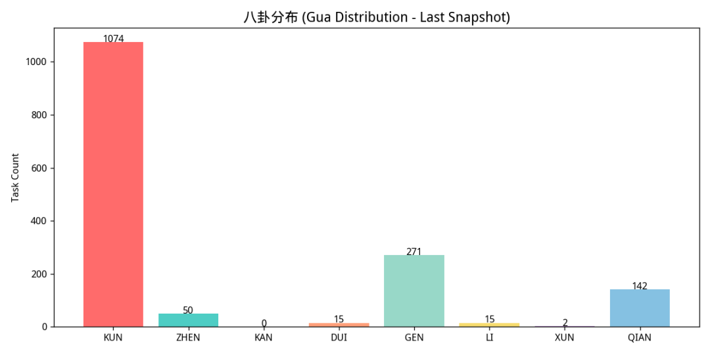
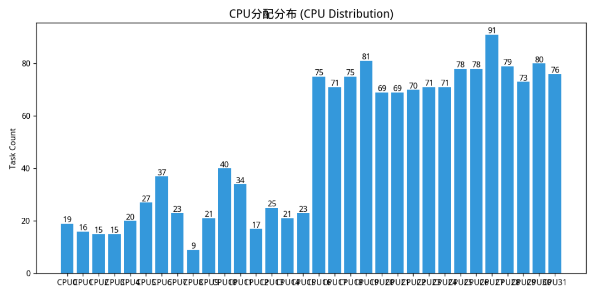
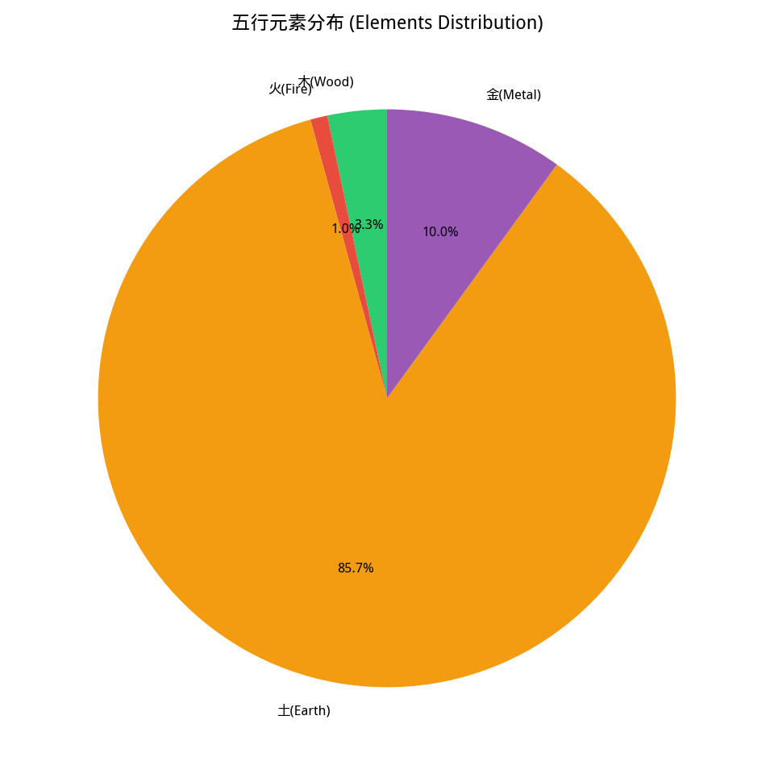
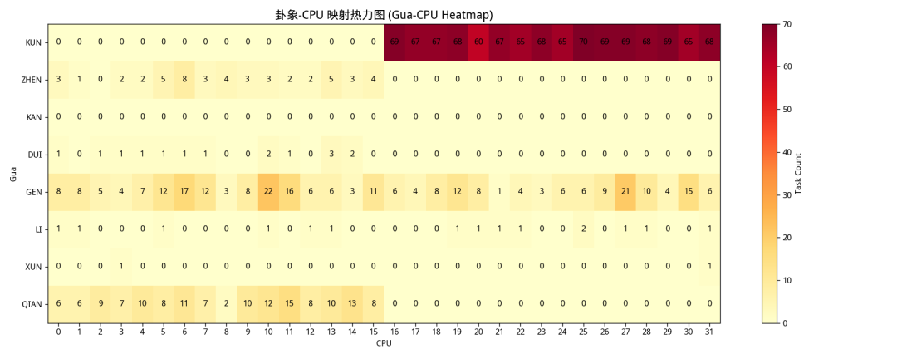
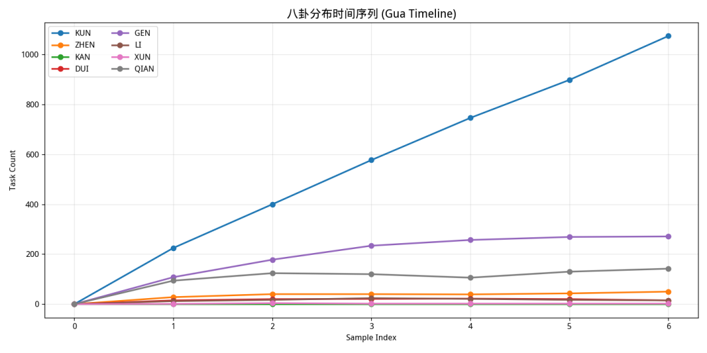
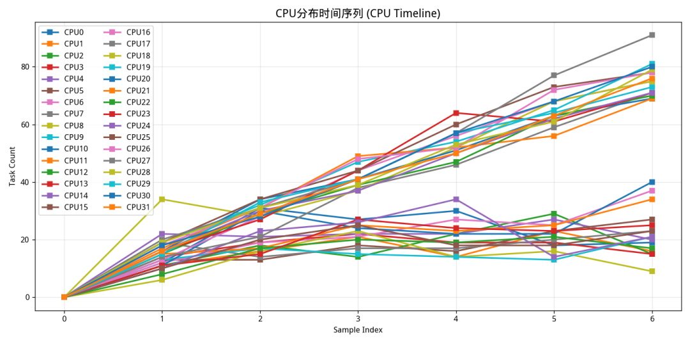
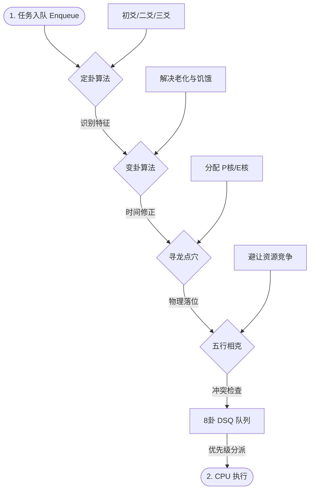

> 本篇源代码丢失，迁移自微信公众号

> 本调度器纯属整活，不用太较真于调度效果。阅读大约需要 26 分钟，篇幅较长，故没有太多代码块示例，建议前往仓库参考。

在 Linux 内核调度领域，我们习惯了用“红黑树”、“时间片”、“权重”来描述进程的生存。但在最新的 `sched_ext` 框架下，我尝试打破工程学的枯燥，从中国最古老的经典《易经》中汲取灵感，构建了一套名为 "风水" 的调度算法。

整套调度算法由定卦、变卦、寻龙点穴、五行相克四种算法组合而成，完美契合了现代异构计算（如英特尔经典大小核架构）对动态平衡的需求。

## 定卦算法

> 《易·系辞》：“是故易有太极，是生两仪，两仪生四象，四象生八卦。”

在风水调度器中，“定卦算法”（The Trigram Determination Algorithm）是整个系统的灵魂。它的核心任务是将复杂的、多维度的内核进程统计数据，高度抽象为《易经》中的**八卦**画像，进程不再仅仅是一个 PID，而是一个拥有“性格”的生命体。`calculate_task_gua` 函数通过观测进程的三个维度，生成“三爻”，最终合成八卦画像：

*  初爻（底）：计算强度。 对应“阳”为高 CPU 占用，意为“刚健”。
*  二爻（中）：交互频率。 对应“阳”为自愿上下文切换频繁，意为“灵动”。
*  三爻（顶）：空间足迹。 对应“阳”为内存 RSS 占用大，意为“厚重”。

当这三爻组合在一起，就形成了八种截然不同的进程画像：

| 卦象           | 二进制 | 属性 | 进程画像示例            | 调度隐喻                 |
| ------------ | --- | -- | ----------------- | -------------------- |
| **乾 (Qian)** | 111 | 纯阳 | 高性能编译、加密运算        | **亢龙**：分配最强核心，最长时间片  |
| **坤 (Kun)**  | 000 | 纯阴 | 后台静默守护进程 (Daemon) | **地势**：分配能效核心，避免干扰   |
| **坎 (Kan)**  | 010 | 水  | 网络包处理、频繁 I/O 等待   | **流转**：快速响应，短时间片高频调度 |
| **离 (Li)**   | 101 | 火  | 视频渲染、图形计算         | **炫烈**：高功耗，需注意散热与吞吐  |
| **震 (Zhen)** | 001 | 雷  | 突发性的交互反馈          | **雷动**：极高优先级，瞬间爆发性能  |
| **艮 (Gen)**  | 100 | 山  | 内存大但计算少的缓存服务      | **止欲**：亲和性绑定，减少数据迁移  |
| **巽 (Xun)**  | 110 | 风  | 灵活的逻辑处理任务         | **柔顺**：在核心间灵活流动负载均衡  |
| **兑 (Dui)**  | 011 | 泽  | 多人协作/同步频繁的任务      | **润泽**：侧重核心间同步效率     |

### 实现细节

#### 高频观测与低开销

定卦是在 enqueue（入队）阶段进行的。通过 eBPF 的 `BPF_CORE_READ` 直接读取内存，省去了传统用户态分析工具的上下文切换开销，实现了毫秒级的实时画像。

#### 历史记忆（Stateful Analysis）

算法使用了 `task_ctx_map`（BPF Hash Map）来存储每个进程上一次的状态（`last_vruntime`, `last_nvcsw`）。定卦不是看快照，而是看增量（Delta）。只有通过增量，我们才能区分一个进程是“正在努力工作的乾卦”还是“已经收工的坤卦”。

#### 启发式演进

代码中不仅有阈值判断，还有对“新任务”的特殊处理：

`if (is_new_task && runtime > 0) yao1 = 1; // 新任务初始赋予阳气，快速启动`

这体现了“生生不息”的哲学，给新生命（新进程）以优先发展的机会。

## 寻龙点穴算法

> 《葬书》：“气乘风则散，界水则止。古人聚之使不散，行之使有止，故谓之风水。”

在风水调度器中，“寻龙点穴”算法（The Fengshui-based CPU Placement Algorithm）负责解决调度器中最核心的问题：任务该去哪个 CPU 核心运行？

如果说“定卦”是认清任务的本性，那么“寻龙点穴”就是为这些本性各异的任务找到最能发挥其潜能的“风水宝地”。

在地理风水中：

*  寻龙：勘察山脉的走向和起伏，寻找能量聚集的“龙脉”（在内核中，这对应于 CPU 拓扑结构，如缓存层次、P/E 核心分布）。
*  点穴：在龙脉上寻找能量最集中的那个点（在内核中，这对应于 具体的物理核心 ID）。

在 `sched.bpf.c` 的 `select_cpu_by_fengshui` 函数中，我们通过对系统拓扑的感知，将任务的“卦象”与核心的“物理特性”进行精准匹配。

### 实现细节

#### 寻龙：感知架构之“气”

算法的第一步是初始化系统配置（`init_sys_config`）。调度器启动时，会在用户空间探测主机的“龙脉”：

*  性能核心（P-Core）：主频高、支持超线程，是为“天位”。
*  能效核心（E-Core）：功耗低、核心多，是为“地位”。
*  缓存亲和性：核心之间的物理距离。

之后将架构信息存入 `sys_config_map` 再转入内核空间，通过 `sys_config_map`，调度器实时掌握了系统中哪些是“崇山峻岭”（大核），哪些是“平原沃土”（小核）。

#### 点穴：因卦施策的落位逻辑

根据定卦算法得出的不同卦象，寻龙点穴算法执行不同的分派策略：

#### 1\. 乾卦点穴：位极天位（Performance First）

*  **策略**：`selected_cpu = pid % num_perf_cpus;`
*  **逻辑**：乾为天，纯阳。这类任务是系统中的主力（如 3D 渲染、编译）。算法将其分配到**性能核心（P-Core）**。
*  **目的**：确保最强悍的任务拥有最宽的指令流水线和最高的频率，践行“大材大用”。

#### 2\. 坤卦点穴：安于地位（Efficiency First）

*  **策略**：`selected_cpu = num_perf_cpus + (pid % eff_cpu_count);`
*  **逻辑**：坤为地，纯阴。这类任务多为后台静默进程。算法将其“点”在能效核心（E-Core）上。
*  **目的**：保护大核不被琐碎的小任务打断，同时降低系统整体功耗。

#### 3\. 震卦点穴：雷动于心（Low Latency）

*  **策略**：优先选择 `current_cpu`。
*  **逻辑**：震为雷，代表突发和响应。如果当前就在高性能核心，则原地不动。
*  **目的**：避免跨核迁移带来的缓存冷启动开销，追求“瞬间爆发”的响应速度，实现“动如雷霆”。

#### 4\. 离卦点穴：火性发散（Thermal Balancing）

*  **策略**：`selected_cpu = (pid + current_cpu) % num_cpus;`
*  **逻辑**：离为火，代表高热量。
*  **目的**：如果多个“火”任务挤在一个 CPU 簇，会触发热节流导致降频。寻龙点穴算法会将这类任务**均匀散布**到不同的物理簇中，利用物理空间进行散热。

#### 5\. 艮卦点穴：山止不动（Affinity Sticky）

*  **策略**：`selected_cpu = current_cpu;`
*  **逻辑**：艮为山，主静止。
*  **目的**：针对内存占用大的任务，严禁其跨核移动，以保护 L1/L2 缓存的命中率，稳如泰山。

通过这套算法，风水调度器让 Linux 内核在异构计算时代，拥有了一双能够看透硬件拓扑与进程本性的“风水慧眼”。

## 变卦算法

> 《易·系辞》：“易穷则变，变则通，通则久。”

在风水调度器中，“变卦算法”（The Hexagram Transformation Algorithm）体现了《易经》最核心的思想：“变”。

如果说“定卦”是给进程画了一张静态的像，那么“变卦”就是引入了时间的维度。它解决了调度算法中一个永恒的难题：任务状态的演进与老化（Aging）。

在自然规律中，没有永远的“刚健”，也没有永远的“沉静”。在内核调度中，一个长时间占据 CPU 的任务如果不受约束，就会演变成“独裁者”；一个在队列里苦苦等待的任务如果无人问津，就会产生“饥饿”。

“变卦”算法通过监控任务运行或等待的时长（`elapsed_ns`），动态地翻转卦象中的“爻”，强制任务进入下一个生命周期。

### 实现细节

在 `handle_bian_gua` 函数中，算法通过监测进程的 `elapsed_ns`（运行或等待的持续时长），对已经确定的卦象进行“翻转”。

#### 1\. 阳极生阴：亢龙有悔（防止垄断）

*  **触发条件**：卦象为 **乾卦（GUA\_QIAN, 111）**，且持续运行时间超过 **50ms**。
*  **变卦结果**：三爻全变，化为 **坤卦（GUA\_KUN, 000）**。
*  **哲学解释**：乾为首，久用则力竭。当一个高性能任务占据最强核心太久，它会演化为“亢龙”，产生过热并挤占其他任务空间。
*  **调度策略**：强制将其降级为“坤”，时间片缩短，并可能在下次调度时迁移至能效核心，让 CPU“喘口气”。

#### 2\. 阴极生阳：地天泰（防止饥饿）

*  **触发条件**：卦象为 **坤卦（GUA\_KUN, 000）**，且在就绪队列中等待超过 **100ms**。
*  **变卦结果**：三爻全变，化为 **乾卦（GUA\_QIAN, 111）**。
*  **哲学解释**：坤为地，深埋地下。当一个后台任务被冷落太久，系统必须赋予其“阳气”。
*  **调度策略**：通过变卦，该任务在下一次入队时会被识别为“乾”，从而获得进入高性能核心的权限和最长的时间片，确保其任务能快速处理完，不再积压。

#### 3\. 单爻微变：动态流转（微调）

*  **触发条件**：运行时间处于中等区间（10ms - 50ms）。
*  **变卦结果**：翻转最低位（初爻），如 **震（001）↔ 离（101）** 的微调。
*  **逻辑**：对于非极端的任务，通过改变初爻（计算强度特征），让任务在不同性质的核心间进行小幅度的扰动。
*  **目的**：打破调度死锁和同步等待的僵局，保持系统内部的“流动性”。

传统的调度器处理 Aging 需要复杂的浮点数运算或多级反馈队列。而变卦算法仅需一次位运算（XOR）即可完成优先级的剧烈跳转或平滑过渡。此外，变卦算法确保了没有任何一个进程能永远处于系统的顶端，也没有任何一个进程会永远沉沦在底层，实现了统计学意义上的动态公平。

变卦算法让风水调度器从一个“分类器”进化成了一个“生态系统”。它承认了进程状态的瞬息万变，并用一种极其优雅、充满哲学智慧的方式，在 Linux 内核中实现了**生生之谓易**的运行逻辑。

## 五行相生相克算法

> 《尚书·洪范》：“五行：一曰水，二曰火，三曰木，四曰金，五曰土。”

在风水调度器中，“五行相生相克算法”（The Five Elements Inter-promotion and Inter-restriction Algorithm）负责处理调度中最微观、也最棘手的问题：资源竞争与协同（Resource Contention & Synergy）。

如果说“定卦”是画像，“点穴”是空间布局，“变卦”是时间演化，那么“五行”就是任务与任务之间、任务与核心之间的“气场”碰撞。

我将复杂的计算机资源抽象为五种基本能量形态：

*  木（Wood）：代表“生发”，指进程创建、协议栈处理、控制逻辑。
*  火（Fire）：代表“炎上”，指高功耗计算、浮点运算、GPU/NPU 任务。
*  土（Earth）：代表“沉稳”，指内存存取、缓存操作、持久化存储。
*  金（Metal）：代表“肃杀”，指底层 I/O、磁盘写入、硬件中断处理。
*  水（Water）：代表“流动”，指网络数据流、跨核通信、流媒体缓冲。

### 实现细节

#### 从卦象到五行的映射

调度器首先通过 `gua_to_xingwu` 函数，将定卦算法得出的八卦画像转换为五行属性。这体现了“万物归根”的思想：

*  **乾/兑  金**：刚健、肃杀，对应高性能或底层同步。
*  **震/巽  木**：动感、生发，对应响应性强的控制流。
*  **坤/艮  土**：厚重、静止，对应存储与内存密集。
*  **离  火**：灼热、升腾，对应高负载计算。
*  **坎  水**：润下、流动，对应网络与 I/O 等待。

#### 相生相克：微架构的优化策略

算法通过 `is_conflict` 函数实现了五行相克的逻辑。在 Linux 内核中，这主要用于**规避资源冲突**和**优化缓存预热**。

#### 1\. 五行相克：规避“两虎相争”

> **逻辑**：木克土，土克水，水克火，火克金，金克木。

在调度决策时，如果一个 CPU 核心已经运行了某种属性的任务，调度器会尽量避免调度“克制”它的任务进入同一个缓存域或物理簇：

*  **水克火（避暑）**：如果核心正在进行高功耗计算（火），调度器会优先插入一个网络 I/O 等待任务（水）。因为“水”任务会让 CPU 处于空闲或低频状态，通过“水火既济”实现自然的散热降温，避免触发热节流降频。
*  **火克金（避让）**：如果系统正在进行敏感的底层 I/O 同步（金），禁止立即在该簇执行超大规模计算（火），防止因功耗瞬变导致的电压不稳或互斥锁竞争。

#### 2\. 五行相生：实现“借势发力”

> **逻辑**：木生火，火生土，土生金，金生水，水生木。

这是调度器隐藏的优化逻辑（Synergy）：

*  **水生木（流水不腐）**：当网卡收到大量数据流（水）时，调度器会优先在临近核心唤醒协议栈处理进程（木）。因为“水”带来了数据，正好滋养了“木”的逻辑处理。
*  **金生水（点石成金）**：底层的磁盘控制器（金）完成数据读取后，快速触发流媒体分发逻辑（水），利用刚刚预热好的缓存。

传统的调度器不知道两个进程在抢什么资源。五行算法通过抽象属性，让调度器意识到：“这两个任务虽然都只用了 50% CPU，但它们都在抢内存带宽（土克水）”，从而将它们分派到不同的物理簇。

相较于内核温控组件（Thermal Governor）秒级的响应，五行算法在 enqueue 级别就通过“水火”编排实现了热量抑制。

“相生”逻辑本质上是**空间局部性**的另一种表达。它让具有数据依赖关系的任务在时间和空间上更加靠近。

五行相生相克算法不再孤立地看一个任务，而是观察任务间的关系。通过这套机制，调度器在多核之间建立了一种微观平衡，使得整个系统不仅是“公平”的，更是“和谐”的。

## 四种算法相互协同

在风水调度器中，这四种算法并非孤立的逻辑块，而是一个严密的、互为输入输出的闭环协同系统。它们模拟了一个生命体从“出生（入队）”到“成长（执行）”再到“衰老（老化）”的全过程。

### 第一阶段：入队感知（Enqueue）

当一个进程进入就绪队列时，调度器必须在微秒级时间内完成“定性”。

1. 1\. **定卦 (Ding Gua) —— 初始识别**：
  *  调度器首先调用 `calculate_task_gua`。它读取该进程的历史统计数据（CPU利用率、上下文切换、内存占用）。
  *  **协同输出**：产生一个基础卦象（如：乾、坤、坎等）。这决定了该任务的“本性”。
2. 2\. **变卦 (Bian Gua) —— 时间修正**：
  *  紧接着，调度器检查该进程的“年龄”（等待了多久）或“疲劳度”（运行了多久）。
  *  **协同机制**：变卦算法会**重写**定卦的结果。例如，定卦认为它是“乾（强计算）”，但变卦发现它运行太久触发了“亢龙有悔”，强制将其变卦为“坤”。
  *  **最终结果**：输出一个经过时间维度修正后的**最终卦象**。

### 第二阶段：资源映射（Mapping）

得到最终卦象后，调度器需要将其翻译为物理层面的指令。

1. 3\. **五行映射 (Wu Xing Mapping)**：
  *  调度器通过 `gua_to_xingwu` 将最终卦象转换为五行元素（金、木、水、火、土）。
  *  **协同价值**：这一步为后面的“冲突检查”准备好了元数据。
2. 4\. **寻龙点穴 (Xun Long Dian Xue) —— 初步定点**：
  *  根据最终卦象，调用 `select_cpu_by_fengshui`。
  *  **协作逻辑**：如果是“乾”，点穴算法指向 **P-Core**；如果是“坤”，指向 **E-Core**。
  *  **协同输出**：选定一个目标物理核心 `assigned_cpu`。

### 第三阶段：和谐度检查（Conflict Check）

在任务真正进入队列前，需要进行最后一步“环境评估”。

1. 5\. **五行相克 (Wu Xing Inter-restriction) —— 冲突规避**：
  *  调度器检查目标核心（`assigned_cpu`）当前运行的任务属性。
  *  **协同验证**：调用 `is_conflict`。如果目标核心已有“火”任务，且当前点穴点入的也是“火”任务，则判定为“火火相煎，过热风险”。
  *  **反馈修正**：如果发生冲突，点穴算法会进行微调（如迁移到相邻核心或放入全局共享队列），确保系统内部的“气场”和谐。

### 第四阶段：执行分发（Dispatch）

最后，在 CPU 空闲请求任务时，执行分发逻辑。

1. 6\. **DSQ 优先级排队**：
  *  根据卦象，任务被放入 8 个不同的数据序列队列（DSQ）。
  *  **协同权重**：
    *  **乾/离（金/火）**：被赋予长时间片（10ms），放在高优先级分发队列。
    *  **坤/坎（土/水）**：被赋予短时间片（1ms），放在后台分发队列。
  *  **最终执行**：CPU 按照“乾 > 离 > 震 > ... > 坤”的顺序从队列中提取任务。

## 调度效果测试

创建一个测试脚本 `test_scheduler.sh`，分为CPU密集型任务、混合负载 (CPU + 内存)和I/O密集型 + CPU轻负载三种测试场景依次使用 stress-ng 进行压力测试，并间隔10秒记录调度数据，一分钟后停止采集数据，绘制得到调度效果图：

卦象分布柱状图

CPU分配分布柱状图

五行元素分布饼图

卦象-CPU映射热力图

卦象时间序列折线图

CPU分配时间序列折线图

## 总结

可以用一个流程图来概括整个风水调度算法：

**这种协同的精髓在于：**

- **定卦**提供了**准确性**。
- **变卦**提供了**公平性**（防止饥饿）。
- **寻龙点穴**提供了**性能分配**（利用异构架构）。
- **五行相克**提供了**稳定性**（规避微架构冲突）。

四者合一，使得风水调度器不再是一个死板的数学模型，而是一个能够自我感知、自我演化、因地制宜的**智能系统**。

###### 代码仓库：https://github.com/gujial/scheduling
